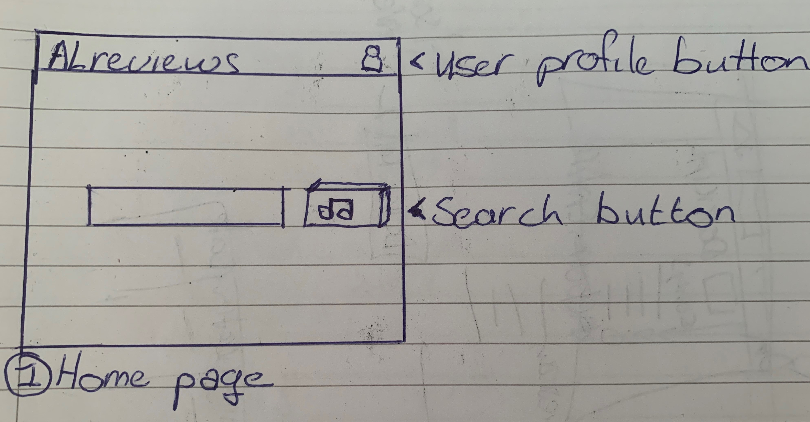
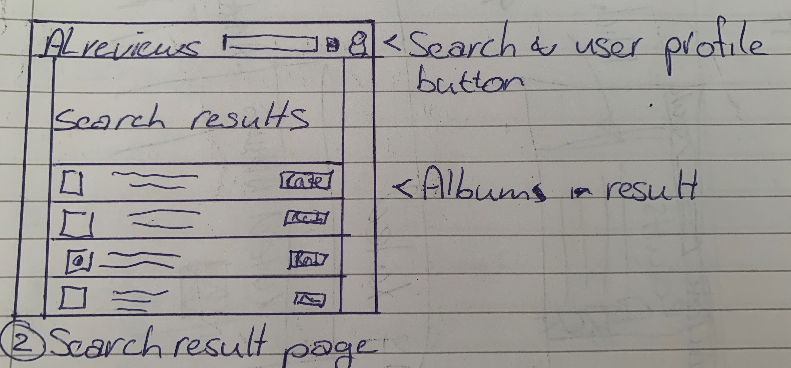
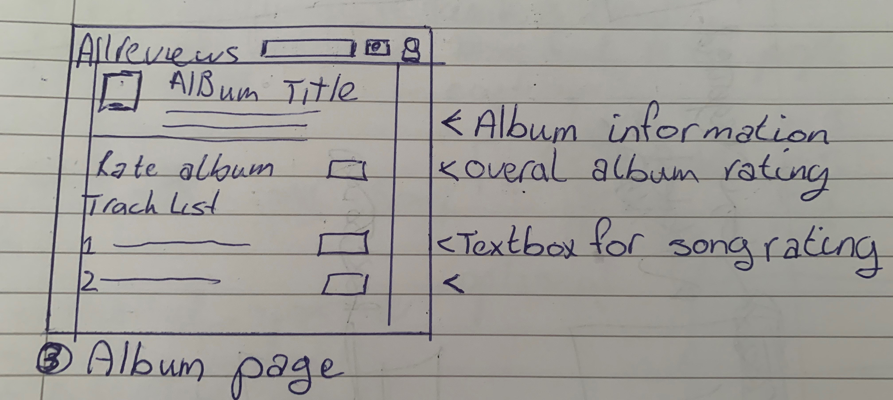
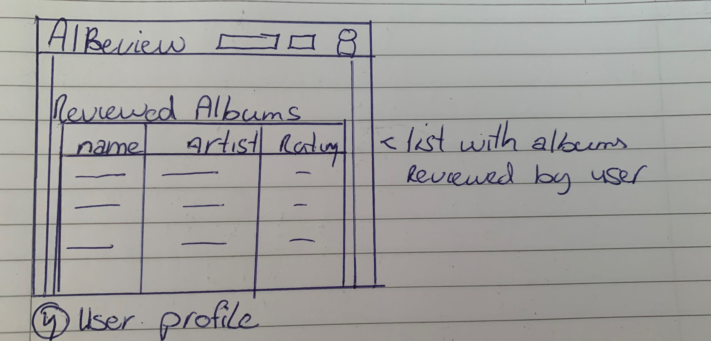

# Alreviews

This is a flask application that implements a rating system for albums. The application uses the AudioDB api to gather information
about albums by an sertain artist and gives the user questions with which every song and the entire album as a whole is rated.

## Problem statement

After listening to an album most of the times my friends ask me what I think of it and all i can answer is "I liked it" or "I hated it". With this application I'd like to create a way to be more critical with the albums I listen to and formulate a better oppinion about albums I've listened to in the past.

## Solution description

With the app I will be able to look up a sertain album by an artist, answer questions about what I thought about a song and the entire album and this will generate a grade and this will be added to a list of albums I've graded before.

## Data sources

The data sources that will be used to gather the needed information are:

- The AudioDB API: to gather information about an album (https://www.theaudiodb.com/api_guide.php?ref=apilist.fun)

## External components

To implement this application I will be using:

- Flask: to create the server
- SQLalchemy: to create the database
- Bootstrap/CSS: to style the application

## Details and sketches

### Homepage
The first page of the application is the homepage. On this page the user will be able to 
search for an album by filling in the textbox and pressing the seach button. The user can also
go to the user profile by pressing the icon in the navbar. 

---

### Search result
The second page displays the search result from the user's query. This page loads the name, 
artist and basic information of every album related to the user query. the user can select an album 
to review by pressing the review button. 

---

### Album page 
This page firstly displays basic information about the selected ablum. Thereafter the user is presented
with the tracklist of set album and a textbox inwhich the user can rate a song. This is followed by
a textbox where the user can leave their thoughts about the album. 

---

### User page

On this page the user can see their reviewed album.

---

## Hardest parts
The hardest parts to implement will be: 
- Perfoming the API requests
- calculating the ratings
- Making the UI 
